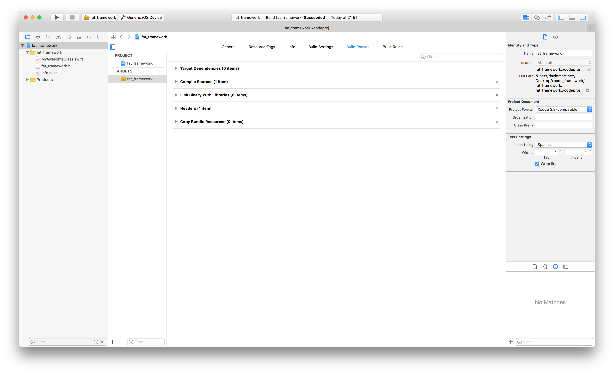
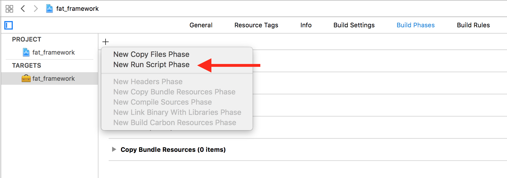
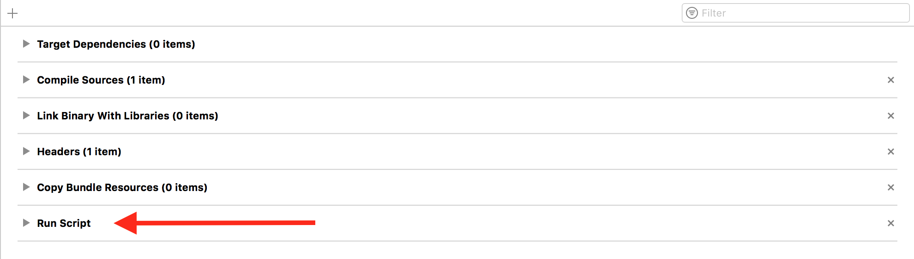
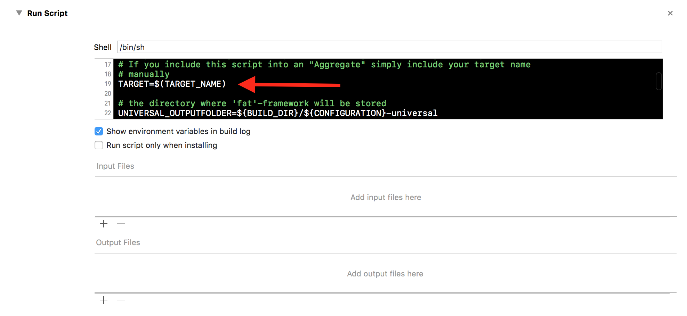
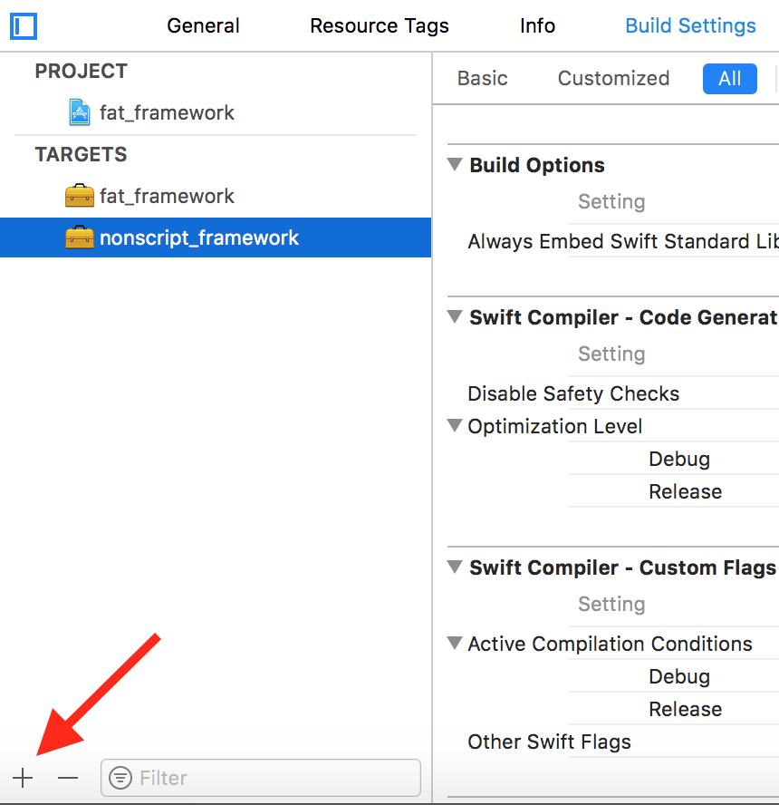
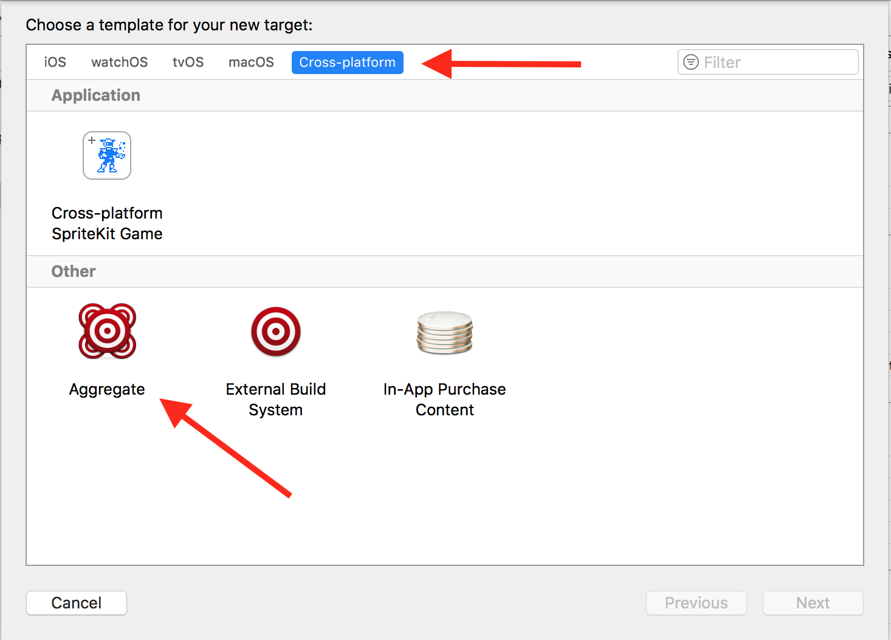
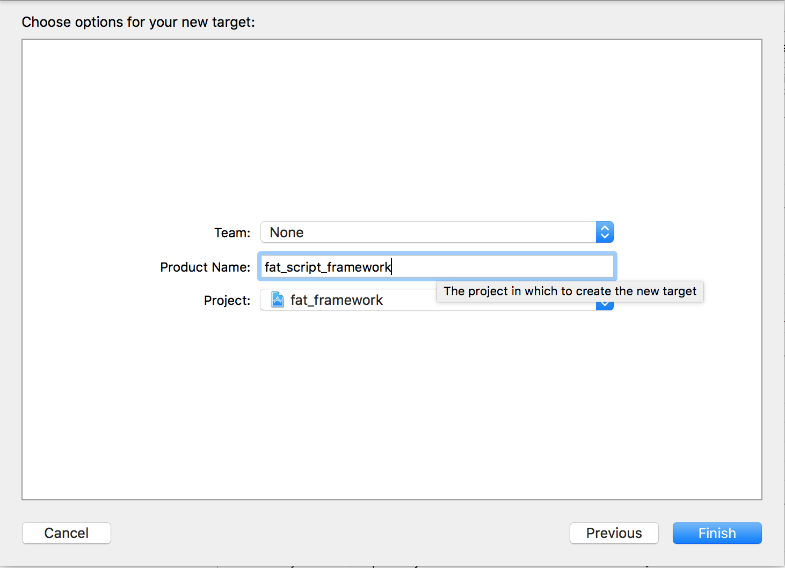
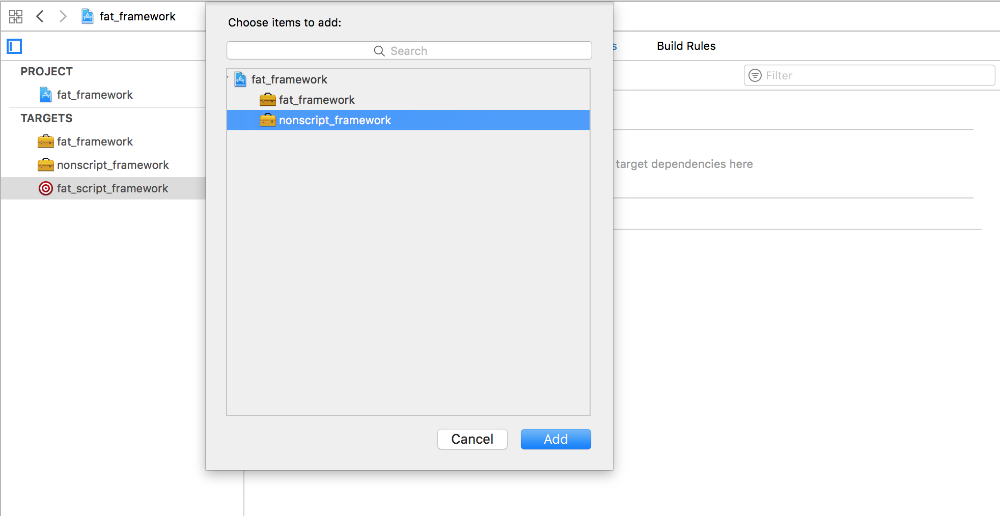
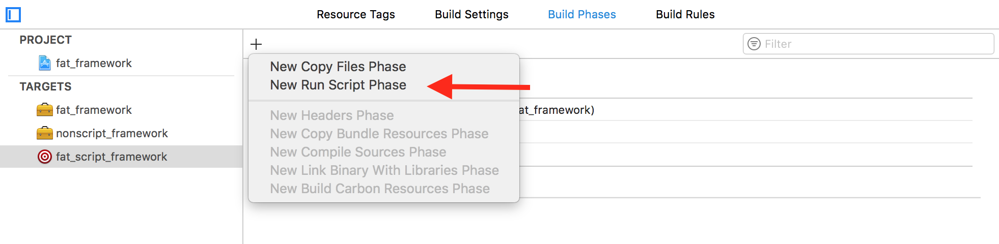

# xcode-script-cross_platform_framework
A script for creating a cross-platfrom framework for xcode 8.

# Instructions
## A. Include the script into my framework target
1. Click on the project file
2. Select your framework target into target column
3. Go to Build Phases
    

4. Click on '+' icon and select "New run script phase"
    

    a new entry called 'Run Script' will appear:
    

5. Copy and paste the script into the 'Run Script' box and replace <Put_your_target_name_here> with $(TARGET_NAME)
    

6. Compile this target


## B. Include the script into an Aggregate
Suppose that 'nonscript_framework' already exists (and it hasn't the script define previously)
1. Click on the project file
2. Create the aggregate clicking into '+' of Project and Targets column
    

3. In the new window select 'cross-platform' and the 'Aggregate'
    

4. Choose a name for your aggregate and click on "Finish"
    

5. Go to Build Phases in your aggregate
6. In "Target Dependencies" select '+' and add the base framework
    

7. Click on '+' icon and select "New run script phase"
    

8. Copy and paste the script into the 'Run Script' box and replace <Put_your_target_name_here> with your framework name, in our example 'nonscript_framework'
9. Compile this target

## Notes:
* English commented script [here](./en_script_fat_framework.sh)
* Spanish commented script [here](./es_script_fat_framework.sh)
* Make sure the selected 'shell' is **/bin/sh** in your Run Script
* If you want a Debug framework
    -> compile with an iphonesimulator into scheme (or any debug scheme)
* If you want a Release framework
    -> archive target or select any release scheme
* You could find an example [here](./example/). The xcode example include how to add Objective-C and Swift files into the framework.
* Remember you could replace the <Put_your_target_name_here> alias with $(TARGET_NAME) when no using aggregates. Example:
```
TARGET="${TARGET_NAME}"
```
* You can check the architectures with:
```shell
lipo -info <framework_name>.framework/<framework_name>
```
